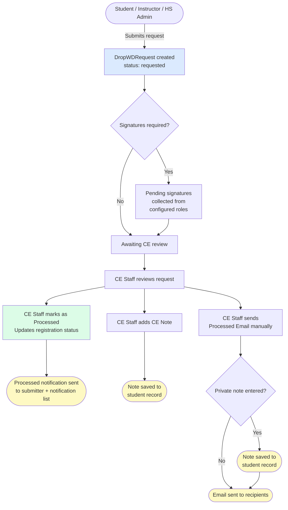

# Drop/WD Request — Settings Guide

This guide walks you through configuring the Drop/Withdrawal Request feature for your institution. All settings are managed from **Settings → Drop/WD Requests** in the CE staff portal.

---

## How Requests Flow

The diagram below shows the full lifecycle of a drop request from submission through processing.



---

## Settings Reference

### Enabled

Controls whether the Drop/WD Request feature is active.

| Value | Behaviour |
|---|---|
| **Yes** | Feature is fully active |
| **No** | No emails are sent; requests can still be submitted |
| **Debug** | Emails are sent only to the debug address (`kadaji@gmail.com`) |

---

### Allowed Terms

Select which academic terms students and staff may submit drop requests for.

> **Important:** If no terms are selected, the "Submit New Request" tab will display a message stating that drop requests are not permitted. This is the recommended way to temporarily disable submissions without turning off the feature entirely.

**Example:** Select only the current active term to prevent requests for past or future terms.

---

### Allowed Registration Statuses

Select which student registration statuses are eligible for a drop request.

Only students whose registration is in one of the selected statuses will appear in the student dropdown, and only those registrations can be submitted.

**Common selections:**
- `Registered` — student is actively enrolled
- `Pending Enrollment` — student is in the enrollment queue

Leave empty to allow all statuses.

---

### Allowed Class Section Statuses

Select which class section statuses are shown when a term is selected in the submit form.

| Value | Meaning |
|---|---|
| **Active** | Section is currently running |
| **Cancelled** | Section has been cancelled |

**Recommended:** Select **Active** only to prevent drop requests for cancelled sections.

Leave empty to show all sections.

---

### Who Can Start a New Request

Check each role that is permitted to initiate a drop/WD request.

| Role | Portal |
|---|---|
| Student | Student portal |
| Instructor | Instructor portal |
| High School Administrator | HS Admin portal |

CE staff can always create requests regardless of this setting.

---

### Who Needs to Approve a New Request

Check each role whose approval (signature) is required before a request is considered complete.

When a request is submitted by a role that is also required to approve it, their signature is automatically set to **Approved** — they do not need to sign separately.

**Example workflow:**
- Instructor submits → Instructor signature auto-approved → Student signature pending → HS Admin signature pending

---

### Who Should Be Notified

Check each party who should receive an email when a request is submitted and when it is marked as processed.

| Recipient | Notes |
|---|---|
| Student | Student's account email |
| Parent | Student's parent email on file (if valid) |
| Instructor | Class section instructor |
| High School Administrator | Assigned reviewer for the registration |

> The person who **submitted** the request always receives the processed notification regardless of this list.

---

## Email Templates

### Request Received — Email to CE Office

Sent to the CE office email address(es) when a new request is submitted.

**To address:** Enter one or more comma-separated email addresses in **To CE Office — Email Address**.

**Available short codes:**

| Short code | Inserts |
|---|---|
| `{{submitted_by_first_name}}` | First name of person who submitted |
| `{{submitted_by_last_name}}` | Last name of person who submitted |
| `{{course_name}}` | Course name |
| `{{class_section_number}}` | Class section number |
| `{{note}}` | Note from the submitter |
| `{{student_first_name}}` | Student first name |
| `{{student_last_name}}` | Student last name |
| `{{instructor_first_name}}` | Instructor first name |
| `{{instructor_last_name}}` | Instructor last name |
| `{{term}}` | Academic term |

**Example:**

```
A new Drop/WD request has been submitted.

Submitted by: {{submitted_by_first_name}} {{submitted_by_last_name}}
Student: {{student_first_name}} {{student_last_name}}
Course: {{course_name}} (Section {{class_section_number}})
Term: {{term}}
Instructor: {{instructor_first_name}} {{instructor_last_name}}

Note from submitter:
{{note}}
```

---

### Request Submitted/Processed — Email

Sent to the submitter and all checked notification recipients when a request is submitted and again when it is marked as processed.

**Available short codes:**

| Short code | Inserts |
|---|---|
| `{{student_first_name}}` | Student first name |
| `{{student_last_name}}` | Student last name |
| `{{instructor_first_name}}` | Instructor first name |
| `{{instructor_last_name}}` | Instructor last name |
| `{{course_name}}` | Course name |
| `{{request_status}}` | Current request status |
| `{{registration_status}}` | Student's registration status |
| `{{ce_note}}` | Note added by CE staff (if any) |
| `{{term}}` | Academic term |

**Example:**

```
Hello {{student_first_name}},

Your Drop/WD request for {{course_name}} ({{term}}) has been {{request_status}}.

Your registration status is now: {{registration_status}}

{{ce_note}}

If you have questions, please contact our office.
```

---

## Page Intro Text

### Intro

Displayed at the top of the Drop/WD Requests page (above the tabs). Use this to provide general information or instructions to users.

### Submit New Request — Intro

Displayed inside the **Submit New Request** tab before the form. Use this to add specific instructions for submitting a request, such as deadlines or policies.

---

## Form Field Labels

The **Request Forms Field Labels** field accepts a JSON object that overrides the default labels and help text for form fields. This allows you to customise the language shown to users without code changes.

The JSON structure is keyed by form name, then field name:

```json
{
  "noncedroprequestform": {
    "note": {
      "label": "Reason for Drop/WD",
      "help_text": "Please explain why you are requesting a drop or withdrawal."
    }
  },
  "studentdroprequestform": {
    "registration": {
      "label": "Select your class",
      "help_text": "Only classes in the current term are shown."
    }
  }
}
```

**Form keys:**

| Key | Form |
|---|---|
| `settingsform` | Settings form (admin) |
| `noncedroprequestform` | Instructor / HS Admin submit form |
| `studentdroprequestform` | Student submit form |
| `cedroprequestform` | CE staff batch request form |
| `requestreviewform` | Approval/review form |

---

## Recommended Initial Setup

1. Set **Enabled** to **Debug** while configuring
2. Select the current active term under **Allowed Terms**
3. Set **Allowed Registration Statuses** to `Registered` and `Pending Enrollment`
4. Set **Allowed Class Section Statuses** to `Active`
5. Check the roles under **Who Can Start a New Request**
6. Configure your email templates using the short codes above
7. Enter CE office email address(es) under **To CE Office — Email Address**
8. Set **Enabled** to **Yes** when ready to go live
